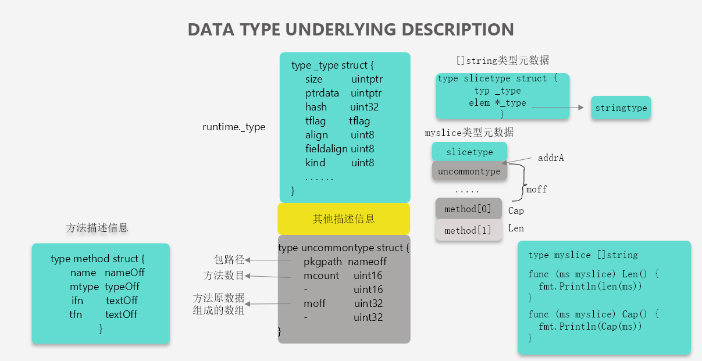
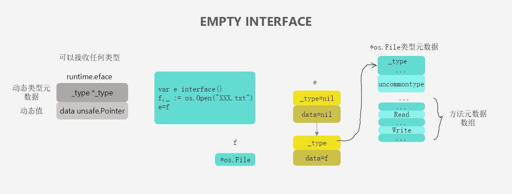
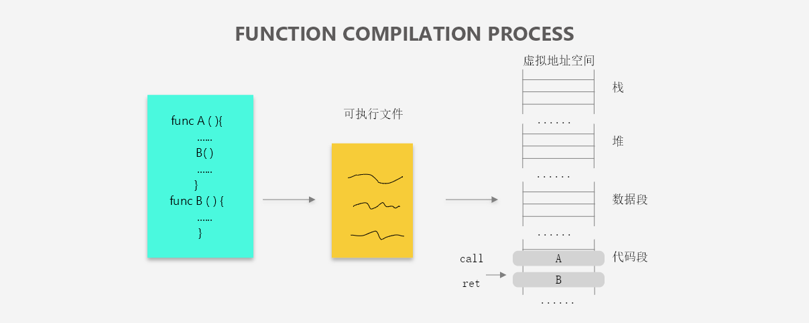
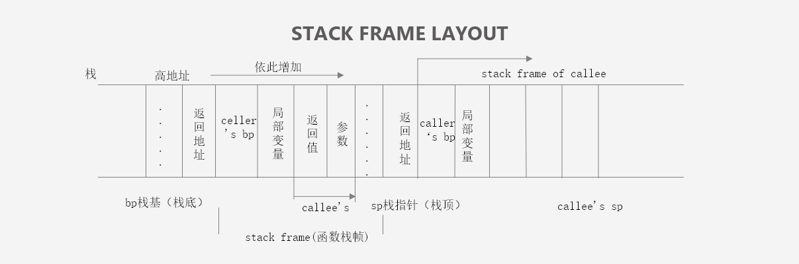

# 数据结构

## 1.1 数组

* **概述**

  Go 语言中数组在初始化之后大小就无法改变，存储元素类型相同、但是大小不同的数组类型在 Go 语言看来也是完全不同的，只有两个条件都相同才是同一个类型。 

  ```go
  [10]int
  [200]interface{}
  ```

  ```go
  func NewArray(elem *Type, bound int64) *Type {
  	if bound < 0 {
  		Fatalf("NewArray: invalid bound %v", bound)
  	}
  	t := New(TARRAY)
  	t.Extra = &Array{Elem: elem, Bound: bound}
  	t.SetNotInHeap(elem.NotInHeap())
  	return t
  }
  ```

  编译期间的数组类型是由上述的 [`cmd/compile/internal/types.NewArray`](https://github.com/golang/go/blob/616c39f6a636166447bdaac4f0871a5ca52bae8c/src/cmd/compile/internal/types/type.go#L473-L481) 函数生成的，类型 `Array` 包含两个字段，一个是元素类型 `Elem`，另一个是数组的大小 `Bound`，这两个字段共同构成了数组类型，而当前数组是否应该在堆栈中初始化也在编译期就确定了。 

* **初始化**

   Go 语言中的数组有两种不同的创建方式，一种是显式的指定数组的大小，另一种是使用 `[...]T` 声明数组，Go 语言会在编译期间通过源代码对数组的大小进行推断：

  ```go
  arr1 := [3]int{1, 2, 3}
  arr2 := [...]int{1, 2, 3}
  ```

   上述两种声明方式在运行期间得到的结果是完全相同的，后一种声明方式在编译期间就会被『转换』成为前一种，这也就是编译器对数组大小的推导。

  * ### 上限推导

    两种不同的声明方式会导致编译器做出完全不同的处理，如果我们使用第一种方式 `[10]T`，那么变量的类型在编译进行到[类型检查](https://draveness.me/golang/docs/part1-prerequisite/ch02-compile/golang-typecheck/)阶段就会被提取出来，随后会使用 [`cmd/compile/internal/types.NewArray`](https://github.com/golang/go/blob/616c39f6a636166447bdaac4f0871a5ca52bae8c/src/cmd/compile/internal/types/type.go#L473-L481) 函数创建包含数组大小的 `Array` 类型。

    当我们使用 `[...]T` 的方式声明数组时，虽然在这一步也会创建一个 `Array` 类型 `Array{Elem: elem, Bound: -1}`，但是其中的数组大小上限会是 `-1`，这里的 `-1` 只是一个占位符，编译器会在后面的 [`cmd/compile/internal/gc.typecheckcomplit`](https://github.com/golang/go/blob/b7d097a4cf6b8a9125e4770b54d33826fa803023/src/cmd/compile/internal/gc/typecheck.go#L2755-L2961) 函数中对该数组的大小进行推导：

    ```go
    func typecheckcomplit(n *Node) (res *Node) {
    	...
    
    	switch t.Etype {
    	case TARRAY, TSLICE:
    		var length, i int64
    		nl := n.List.Slice()
    		for i2, l := range nl {
    			i++
    			if i > length {
    				length = i
    			}
    		}
    
    		if t.IsDDDArray() {
    			t.SetNumElem(length)
    		}
    	}
    }
    ```

    这个删减后的 [`cmd/compile/internal/gc.typecheckcomplit`](https://github.com/golang/go/blob/b7d097a4cf6b8a9125e4770b54d33826fa803023/src/cmd/compile/internal/gc/typecheck.go#L2755-L2961) 函数通过遍历元素的方式来计算数组中元素的数量。上述代码中的 `DDDArray` 指的就是使用 `[...]T` 声明的数组，因为声明这种数组时需要使用三个点（Dot），所以在编译器中就被称作 `DDDArray`。

    所以我们可以看出 `[...]T{1, 2, 3}` 和 `[3]T{1, 2, 3}` 在运行时是完全等价的，`[...]T` 这种初始化方式也只是 Go 语言为我们提供的一种语法糖，当我们不想计算数组中的元素个数时就可以通过这种方法较少一些工作。

  * ### 语句转换

    对于一个由字面量组成的数组，根据数组元素数量的不同，编译器会在负责初始化字面量的 [`cmd/compile/internal/gc.anylit`](https://github.com/golang/go/blob/f07059d949057f414dd0f8303f93ca727d716c62/src/cmd/compile/internal/gc/sinit.go#L875-L967) 函数中做两种不同的优化：

    1. 当元素数量小于或者等于 4 个时，会直接将数组中的元素放置在栈上；
    2. 当元素数量大于 4 个时，会将数组中的元素放置到静态区并在运行时取出；
  
    ```go
    func anylit(n *Node, var_ *Node, init *Nodes) {
    	t := n.Type
    	switch n.Op {
    	case OSTRUCTLIT, OARRAYLIT:
    		if n.List.Len() > 4 {
    			...
    		}
    
    		fixedlit(inInitFunction, initKindLocalCode, n, var_, init)
    	...
    	}
    }
    ```
    
     当数组的元素**小于或者等于四个**时，[`cmd/compile/internal/gc.fixedlit`](https://github.com/golang/go/blob/f07059d949057f414dd0f8303f93ca727d716c62/src/cmd/compile/internal/gc/sinit.go#L515-L583) 会负责在函数编译之前将 `[3]{1, 2, 3}` 转换成更加原始的语句： 
    
    ```go
    func fixedlit(ctxt initContext, kind initKind, n *Node, var_ *Node, init *Nodes) {
    	var splitnode func(*Node) (a *Node, value *Node)
    	...
    
    	for _, r := range n.List.Slice() {
    		a, value := splitnode(r)
    		a = nod(OAS, a, value)
    		a = typecheck(a, ctxStmt)
    		switch kind {
    		case initKindStatic:
    			genAsStatic(a)
    		case initKindLocalCode:
    			a = orderStmtInPlace(a, map[string][]*Node{})
    			a = walkstmt(a)
    			init.Append(a)
    		}
    	}
    }
    ```
    
     当数组中元素的个数小于或者等于四个时，[`cmd/compile/internal/gc.fixedlit`](https://github.com/golang/go/blob/f07059d949057f414dd0f8303f93ca727d716c62/src/cmd/compile/internal/gc/sinit.go#L515-L583) 函数接受的 `kind` 是 `initKindLocalCode`，上述代码会将原有的初始化语句 `[3]int{1, 2, 3}` 拆分成一个声明变量的表达式和几个赋值表达式，这些表达式会完成对数组的初始化： 
    
    ```go
    var arr [3]int
    arr[0] = 1
    arr[1] = 2
    arr[2] = 3
    ```
    
     但是如果当前数组的元素大于四个，`anylit` 方法会先获取一个唯一的 `staticname`，然后调用 [`cmd/compile/internal/gc.fixedlit`](https://github.com/golang/go/blob/f07059d949057f414dd0f8303f93ca727d716c62/src/cmd/compile/internal/gc/sinit.go#L515-L583) 函数在静态存储区初始化数组中的元素并将临时变量赋值给当前的数组： 
    
    ```go
    func anylit(n *Node, var_ *Node, init *Nodes) {
    	t := n.Type
    	switch n.Op {
    	case OSTRUCTLIT, OARRAYLIT:
    		if n.List.Len() > 4 {
    			vstat := staticname(t)
    			vstat.Name.SetReadonly(true)
    
    			fixedlit(inNonInitFunction, initKindStatic, n, vstat, init)
    
    			a := nod(OAS, var_, vstat)
    			a = typecheck(a, ctxStmt)
    			a = walkexpr(a, init)
    			init.Append(a)
    			break
    		}
    		
    		...
    	}
    }
    ```
    
     假设我们在代码中初始化 `[5]int{1, 2, 3, 4, 5}` 数组，那么我们可以将上述过程理解成以下的伪代码： 
    
    ```go
    var arr [5]int
    statictmp_0[0] = 1
    statictmp_0[1] = 2
    statictmp_0[2] = 3
    statictmp_0[3] = 4
    statictmp_0[4] = 5
    arr = statictmp_0
    ```
    
     总结起来，如果数组中元素的个数小于或者等于 4 个，那么所有的变量会直接在栈上初始化，如果数组元素大于 4 个，变量就会在静态存储区初始化然后拷贝到栈上，这些转换后的代码才会继续进入[中间代码生成](https://draveness.me/golang/docs/part1-prerequisite/ch02-compile/golang-ir-ssa/)和[机器码生成](https://draveness.me/golang/docs/part1-prerequisite/ch02-compile/golang-machinecode/)两个阶段，最后生成可以执行的二进制文件。 
  
* **访问和赋值**

    数组访问越界是非常严重的错误，Go 语言中对越界的判断是可以在编译期间由静态类型检查完成的，[`cmd/compile/internal/gc.typecheck1`](https://github.com/golang/go/blob/b7d097a4cf6b8a9125e4770b54d33826fa803023/src/cmd/compile/internal/gc/typecheck.go#L327-L2081) 函数会对访问数组的索引进行验证： 

   ```go
   func typecheck1(n *Node, top int) (res *Node) {
   	switch n.Op {
   	case OINDEX:
   		ok |= ctxExpr
   		l := n.Left  // array
   		r := n.Right // index
   		switch n.Left.Type.Etype {
   		case TSTRING, TARRAY, TSLICE:
   			...
   			if n.Right.Type != nil && !n.Right.Type.IsInteger() {
   				yyerror("non-integer array index %v", n.Right)
   				break
   			}
   			if !n.Bounded() && Isconst(n.Right, CTINT) {
   				x := n.Right.Int64()
   				if x < 0 {
   					yyerror("invalid array index %v (index must be non-negative)", n.Right)
   				} else if n.Left.Type.IsArray() && x >= n.Left.Type.NumElem() {
   					yyerror("invalid array index %v (out of bounds for %d-element array)", n.Right, n.Left.Type.NumElem())
   				}
   			}
   		}
   	...
   	}
   }
   ```

   1. 访问数组的索引是非整数时会直接报错 —— `non-integer array index %v`；
   2. 访问数组的索引是负数时会直接报错 —— `"invalid array index %v (index must be non-negative)"`；
   3. 访问数组的索引越界时会直接报错 —— `"invalid array index %v (out of bounds for %d-element array)"`； 

    数组和字符串的一些简单越界错误都会在编译期间发现，比如我们直接使用整数或者常量访问数组，但是如果使用变量去访问数组或者字符串时，编译器就无法发现对应的错误了，这时就需要 Go 语言运行时发挥作用了：

   ```go
   arr[4]: invalid array index 4 (out of bounds for 3-element array)
   arr[i]: panic: runtime error: index out of range [4] with length 3
   ```

    Go 语言运行时在发现数组、切片和字符串的越界操作会由运行时的 `panicIndex` 和 [`runtime.goPanicIndex`](https://github.com/golang/go/blob/22d28a24c8b0d99f2ad6da5fe680fa3cfa216651/src/runtime/panic.go#L86-L89) 函数触发程序的运行时错误并导致崩溃退出： 

   ```go
   TEXT runtime·panicIndex(SB),NOSPLIT,$0-8
   	MOVL	AX, x+0(FP)
   	MOVL	CX, y+4(FP)
   	JMP	runtime·goPanicIndex(SB)
   
   func goPanicIndex(x int, y int) {
   	panicCheck1(getcallerpc(), "index out of range")
   	panic(boundsError{x: int64(x), signed: true, y: y, code: boundsIndex})
   }
   ```

    当数组的访问操作 `OINDEX` 成功通过编译器的检查之后，会被转换成几个 SSA 指令，假设我们有如下所示的 Go 语言代码，通过如下的方式进行编译会得到 `ssa.html` 文件： 

   ```go
   package check
   
   func outOfRange() int {
   	arr := [3]int{1, 2, 3}
   	i := 4
   	elem := arr[i]
   	return elem
   }
   
   $ GOSSAFUNC=outOfRange go build array.go
   dumped SSA to ./ssa.html
   ```

    `start` 阶段生成的 SSA 代码就是优化之前的第一版中间代码，下面展示的部分就是 `elem := arr[i]` 对应的中间代码，在这段中间代码中我们发现 Go 语言为数组的访问操作生成了判断数组上限的指令 `IsInBounds` 以及当条件不满足时触发程序崩溃的 `PanicBounds` 指令：

   ```go
   b1:
       ...
       v22 (6) = LocalAddr <*[3]int> {arr} v2 v20
       v23 (6) = IsInBounds <bool> v21 v11
   If v23 → b2 b3 (likely) (6)
   
   b2: ← b1-
       v26 (6) = PtrIndex <*int> v22 v21
       v27 (6) = Copy <mem> v20
       v28 (6) = Load <int> v26 v27 (elem[int])
       ...
   Ret v30 (+7)
   
   b3: ← b1-
       v24 (6) = Copy <mem> v20
       v25 (6) = PanicBounds <mem> [0] v21 v11 v24
   Exit v25 (6)
   ```

    `PanicBounds` 指令最终会被转换成上面提到的 `panicIndex` 函数，当数组下标没有越界时，编译器会先获取数组的内存地址和访问的下标，然后利用 `PtrIndex` 计算出目标元素的地址，再使用 `Load` 操作将指针中的元素加载到内存中。 

    当然只有当编译器无法对数组下标是否越界无法做出判断时才会加入 `PanicBounds` 指令交给运行时进行判断，在使用字面量整数访问数组下标时就会生成非常简单的中间代码，当我们将上述代码中的 `arr[i]` 改成 `arr[2]` 时，就会得到如下所示的代码： 

   ```go
   b1:
       ...
       v21 (5) = LocalAddr <*[3]int> {arr} v2 v20
       v22 (5) = PtrIndex <*int> v21 v14
       v23 (5) = Load <int> v22 v20 (elem[int])
       ...
   ```

    Go 语言对于数组的访问还是有着比较多的检查的，它不仅会在编译期间提前发现一些简单的越界错误并插入用于检测数组上限的函数调用，而在运行期间这些插入的函数会负责保证不会发生越界错误。 

    数组的赋值和更新操作 `a[i] = 2` 也会生成 SSA 生成期间计算出数组当前元素的内存地址，然后修改当前内存地址的内容，这些赋值语句会被转换成如下所示的 SSA 操作： 

   ```go
   b1:
       ...
       v21 (5) = LocalAddr <*[3]int> {arr} v2 v19
       v22 (5) = PtrIndex <*int> v21 v13
       v23 (5) = Store <mem> {int} v22 v20 v19
       ...
   ```

    赋值的过程中会先确定目标数组的地址，再通过 `PtrIndex` 获取目标元素的地址，最后使用 `Store` 指令将数据存入地址中，从上面的这些 SSA 代码中我们可以看出无论是数组的寻址还是赋值都是在编译阶段完成的，没有运行时的参与。 

## 1.2 切片

切片就是动态数组，它的长度并不固定，我们可以随意向切片中追加元素，而切片会在容量不足时自动扩容。 

```go
[]int
[]interface{}
```

 从切片的定义我们能推测出，切片在编译期间的生成的类型只会包含切片中的元素类型，即 `int` 或者 `interface{}` 等。[`cmd/compile/internal/types.NewSlice`](https://github.com/golang/go/blob/616c39f6a636166447bdaac4f0871a5ca52bae8c/src/cmd/compile/internal/types/type.go#L484-L496) 就是编译期间用于创建 `Slice` 类型的函数： 

```go
func NewSlice(elem *Type) *Type {
	if t := elem.Cache.slice; t != nil {
		if t.Elem() != elem {
			Fatalf("elem mismatch")
		}
		return t
	}

	t := New(TSLICE)
	t.Extra = Slice{Elem: elem}
	elem.Cache.slice = t
	return t
}
```

 上述方法返回的结构体 `TSLICE` 中的 `Extra` 字段是一个只包含切片内元素类型的 `Slice{Elem: elem}` 结构，也就是说切片内元素的类型是在编译期间确定的，编译器确定了类型之后，会将类型存储在 `Extra` 字段中帮助程序在运行时动态获取。 

* **数据结构**

   编译期间的切片是 `Slice` 类型的，但是在运行时切片由如下的 `SliceHeader` 结构体表示，其中 `Data` 字段是指向数组的指针，`Len` 表示当前切片的长度，而 `Cap` 表示当前切片的容量，也就是 `Data` 数组的大小： 

  ```go
  type SliceHeader struct {
  	Data uintptr
  	Len  int
  	Cap  int
  }
  ```

   `Data` 作为一个指针指向的数组是一片连续的内存空间，这片内存空间可以用于存储切片中保存的全部元素，数组中的元素只是逻辑上的概念，底层存储其实都是连续的，所以我们可以将切片理解成一片连续的内存空间加上长度与容量的标识。 

  


* **初始化**

* **访问元素go**

* **追加和扩容**

* **拷贝切片**

  


## 1.3 哈希表

## 1.4 字符串

## 1.5 数据类型

```go
type MyType1 = int32 // 别名，共用int32类型的元数据，例如rune和int32
type MyType1 int32   // 自定义类型
```

* 数据类型底层描述

  

# 语言基础

## 2.1 接口

定义接口需要使用 `interface` 关键字，在接口中我们只能定义方法签名，不能包含成员变量，一个常见的 Go 语言接口是这样的： 

```go
type error interface {
	Error() string
}
```

如果一个类型需要实现 `error` 接口，那么它只需要实现 `Error() string` 方法，下面的 `RPCError` 结构体就是 `error` 接口的一个实现： 

```go
type RPCError struct {
	Code    int64
	Message string
}

func (e *RPCError) Error() string {
	return fmt.Sprintf("%s, code=%d", e.Message, e.Code)
}
```

Go 语言中**接口的实现都是隐式的**，我们只需要实现 `Error() string` 方法实现了 `error` 接口。 

我们使用上述 `RPCError` 结构体时并不关心它实现了哪些接口，Go 语言只会在传递参数、返回参数以及变量赋值时才会对某个类型是否实现接口进行检查，这里举几个例子来演示发生接口类型检查的时机： 

```go
func main() {
	var rpcErr error = NewRPCError(400, "unknown err") // typecheck1
	err := AsErr(rpcErr) // typecheck2
	println(err) 
}

func NewRPCError(code int64, msg string) error {
	return &RPCError{ // typecheck3
		Code:    code,
		Message: msg,
	}
}

func AsErr(err error) error {
	return err
}
```

Go 语言会[编译期间](https://draveness.me/golang/docs/part1-prerequisite/ch02-compile/golang-compile-intro/)对代码进行类型检查，上述代码总共触发了三次类型检查：

1. 将 `*RPCError` 类型的变量赋值给 `error` 类型的变量 `rpcErr`；
2. 将 `*RPCError` 类型的变量 `rpcErr` 传递给签名中参数类型为 `error` 的 `AsErr` 函数；
3. 将 `*RPCError` 类型的变量从函数签名的返回值类型为 `error` 的 `NewRPCError` 函数中返回；

从类型检查的过程来看，编译器仅在需要时才对类型进行检查，类型实现接口时只需要实现接口中的全部方法，不需要像 Java 等编程语言中一样显式声明。


* **补充知识点**

  

* 接口（抽象类型）可以分为空接口和非空接口两类，断言类型：空接口.(具体类型)；空接口.(非空接口类型)；非空接口.(具体类型)；非空接口.(非空接口类型)。

  * 空接口结构

  * 非空接口结构
  
    
  
  
  
  
  
  


## 2.2 函数调用


* **补充知识点**

  

  

  如果在一个函数中调用另一个函数，编译器就会对应生成一条call指令，程序执行到call指令时就会跳转到被调用函数的入口处开始执行。
  
  * 函数栈帧布局
  
    


# 常用关键字

## 3.1 for和range

for 循环能够将代码中的数据和逻辑分离，让同一份代码能够多次复用处理同样的逻辑。我们先来看一下 Go 语言 for 循环对应的汇编代码，下面是一段经典的三段式循环的代码，我们将它编译成汇编指令： 

```go
package main

func main() {
	for i := 0; i < 10; i++ {
		println(i)
	}
}

"".main STEXT size=98 args=0x0 locals=0x18
	00000 (main.go:3)	TEXT	"".main(SB), $24-0
	...
	00029 (main.go:3)	XORL	AX, AX                   ;; i := 0
	00031 (main.go:4)	JMP	75
	00033 (main.go:4)	MOVQ	AX, "".i+8(SP)
	00038 (main.go:5)	CALL	runtime.printlock(SB)
	00043 (main.go:5)	MOVQ	"".i+8(SP), AX
	00048 (main.go:5)	MOVQ	AX, (SP)
	00052 (main.go:5)	CALL	runtime.printint(SB)
	00057 (main.go:5)	CALL	runtime.printnl(SB)
	00062 (main.go:5)	CALL	runtime.printunlock(SB)
	00067 (main.go:4)	MOVQ	"".i+8(SP), AX
	00072 (main.go:4)	INCQ	AX                       ;; i++
	00075 (main.go:4)	CMPQ	AX, $10                  ;; 比较变量 i 和 10
	00079 (main.go:4)	JLT	33                           ;; 跳转到 33 行如果 i < 10
	...
```

我们将上述汇编指令的执行过程分成三个部分进行分析：

1. 0029 ~ 0031 行负责循环的初始化；
   1. 对寄存器 `AX` 中的变量 `i` 进行初始化并执行 `JMP 75` 指令跳转到 0075 行；
2. 0075 ~ 0079 行负责检查循环的终止条件，将寄存器中存储的数据 `i` 与 10 比较；
   1. `JLT 33` 命令会在变量的值小于 10 时跳转到 0033 行执行循环主体；
   2. `JLT 33` 命令会在变量的值大于 10 时跳出循环体执行下面的代码；
3. 0033 ~ 0072 行是循环内部的语句；
   1. 通过多个汇编指令打印变量中的内容；
   2. `INCQ AX` 指令会将变量加一，然后再与 10 进行比较，回到第二步；

for/range 循环经过优化的汇编代码有着完全相同的结构。无论是变量的初始化、循环体的执行还是最后的条件判断都是完全一样的，所以这里也就不展开分析对应的汇编指令了。

```go
package main

func main() {
	arr := []int{1, 2, 3}
	for i, _ := range arr {
		println(i)
	}
}
```

在汇编语言中，无论是经典的 for 循环还是 for/range 循环都会使用 `JMP` 以及相关的命令跳回循环体的开始位置来多次执行代码的逻辑。从不同循环具有相同的汇编代码可以猜到，使用 for /range 的控制结构最终也会被 Go 语言编译器转换成普通的 for 循环，后面的分析会印证这一点。 

* **现象**

  **循环永动机**

  ```go
  func main() {
  	arr := []int{1, 2, 3}
  	for _, v := range arr {
  		arr = append(arr, v)
  	}
  	fmt.Println(arr)
  }
  
  $ go run main.go
  1 2 3 1 2 3
  ```

  上述代码的输出意味着循环只遍历了原始切片中的三个元素，我们在遍历切片时追加的元素不会增加循环的执行次数，所以循环最终还是停了下来。 

  **神奇的指针**

  第二个例子是使用 Go 语言经常会犯的错误。当我们在遍历一个数组时，如果获取 `range` 返回变量的地址并保存到另一个数组或者哈希时，就会遇到令人困惑的现象： 

  ```go
  func main() {
  	arr := []int{1, 2, 3}
  	newArr := []*int{}
  	for _, v := range arr {
  		newArr = append(newArr, &v)
  	}
  	for _, v := range newArr {
  		fmt.Println(*v)
  	}
  }
  
  $ go run main.go
  3 3 3
  ```

  上述代码最终会输出三个连续的 `3`，这个问题比较常见，一些有经验的开发者不经意也会犯这种错误，正确的做法应该是使用 `&arr[i]` 替代 `&v`。

  **遍历清空数组**

  当我们想要在 Go 语言中清空一个切片或者哈希表时，我们一般都会使用以下的方法将切片中的元素置零，但是依次去遍历切片和哈希表看起来是非常耗费性能的事情： 

  ```go
  func main() {
  	arr := []int{1, 2, 3}
  	for i, _ := range arr {
  		arr[i] = 0
  	}
  }
  ```

  因为数组、切片和哈希表占用的内存空间都是连续的，所以最快的方法是直接清空这片内存中的内容，当我们编译上述代码时会得到以下的汇编指令： 

  ```go
  "".main STEXT size=93 args=0x0 locals=0x30
  	0x0000 00000 (main.go:3)	TEXT	"".main(SB), $48-0
  	...
  	0x001d 00029 (main.go:4)	MOVQ	"".statictmp_0(SB), AX
  	0x0024 00036 (main.go:4)	MOVQ	AX, ""..autotmp_3+16(SP)
  	0x0029 00041 (main.go:4)	MOVUPS	"".statictmp_0+8(SB), X0
  	0x0030 00048 (main.go:4)	MOVUPS	X0, ""..autotmp_3+24(SP)
  	0x0035 00053 (main.go:5)	PCDATA	$2, $1
  	0x0035 00053 (main.go:5)	LEAQ	""..autotmp_3+16(SP), AX
  	0x003a 00058 (main.go:5)	PCDATA	$2, $0
  	0x003a 00058 (main.go:5)	MOVQ	AX, (SP)
  	0x003e 00062 (main.go:5)	MOVQ	$24, 8(SP)
  	0x0047 00071 (main.go:5)	CALL	runtime.memclrNoHeapPointers(SB)
  	...
  ```

  从生成的汇编代码我们可以看出，编译器会直接使用 [`runtime.memclrNoHeapPointers`](https://github.com/golang/go/blob/05c02444eb2d8b8d3ecd949c4308d8e2323ae087/src/runtime/memclr_386.s#L12-L16) 清空切片中的数据，这也是我们在下面的小节会介绍的内容。 

  **随机遍历**

  当我们在 Go 语言中使用 `range` 遍历哈希表时，往往都会使用如下的代码结构，但是这段代码在每次运行时都会打印出不同的结果： 

  ```go
  func main() {
  	hash := map[string]int{
  		"1": 1,
  		"2": 2,
  		"3": 3,
  	}
  	for k, v := range hash {
  		println(k, v)
  	}
  }
  ```

* **经典循环**

  Go 语言中的经典循环在编译器看来是一个 `OFOR` 类型的节点，这个节点由以下四个部分组成： 

  1. 初始化循环的 `Ninit`；
  2. 循环的继续条件 `Left`；
  3. 循环体结束时执行的 `Right`；
  4. 循环体 `NBody`：

  ```go
  for Ninit; Left; Right {
      NBody
  }
  ```

  在生成 SSA 中间代码的阶段，[`cmd/compile/internal/gc.stmt`](https://github.com/golang/go/blob/4d5bb9c60905b162da8b767a8a133f6b4edcaa65/src/cmd/compile/internal/gc/ssa.go#L1023-L1502) 方法在发现传入的节点类型是 `OFOR` 时就会执行以下的代码块，这段代码的会将循环中的代码分成不同的块： 

  ```go
  func (s *state) stmt(n *Node) {
  	switch n.Op {
  	case OFOR, OFORUNTIL:
  		bCond, bBody, bIncr, bEnd := ...
  		
  		b := s.endBlock()
  		b.AddEdgeTo(bCond)
  		s.startBlock(bCond)
  		s.condBranch(n.Left, bBody, bEnd, 1)
  
  		s.startBlock(bBody)
  		s.stmtList(n.Nbody)
  
  		b.AddEdgeTo(bIncr)
  		s.startBlock(bIncr)
  		s.stmt(n.Right)
  		b.AddEdgeTo(bCond)
  		s.startBlock(bEnd)
  	}
  }
  ```

  一个常见的 for 循环代码会被 [`cmd/compile/internal/gc.stmt`](https://github.com/golang/go/blob/4d5bb9c60905b162da8b767a8a133f6b4edcaa65/src/cmd/compile/internal/gc/ssa.go#L1023-L1502) 方法转换成下面的控制结构，该结构中包含了 4 个不同的块，这些代码块之间的连接就表示汇编语言中的跳转关系，与我们理解的 for 循环控制结构其实没有太多的差别。

  

  `机器码`生成阶段会将这些代码块转换成机器码，以及指定 CPU 架构上运行的机器语言，就是我们在前面编译得到的汇编指令。 

* **范围循环**

  与简单的经典循环相比，范围循环在 Go 语言中更常见、实现也更复杂。这种循环同时使用 for 和 range 两个关键字，编译器会在编译期间将所有 for/range 循环变成的经典循环。从编译器的视角来看，就是将 `ORANGE` 类型的节点转换成 `OFOR` 节点: 

  

  节点类型的转换过程都发生在 SSA 中间代码生成阶段，所有的 for/range 循环都会被 [`cmd/compile/internal/gc.walkrange`](https://github.com/golang/go/blob/440f7d64048cd94cba669e16fe92137ce6b84073/src/cmd/compile/internal/gc/range.go#L155-L456) 函数转换成不包含复杂结构、只包含基本表达式的语句。接下来，我们按照循环遍历的元素类型依次介绍遍历数组和切片、哈希表、字符串以及管道时的过程。 

  **数组和切片**

  对于数组和切片来说，Go 语言有三种不同的遍历方式，这三种不同的遍历方式分别对应着代码中的不同条件，它们会在 [`cmd/compile/internal/gc.walkrange`](https://github.com/golang/go/blob/440f7d64048cd94cba669e16fe92137ce6b84073/src/cmd/compile/internal/gc/range.go#L155-L456) 函数中转换成不同的控制逻辑，我们将该函数的相关逻辑分成几个部分进行分析： 

  1. 分析遍历数组和切片清空元素的情况；
  2. 分析使用 `for range a {}` 遍历数组和切片，不关心索引和数据的情况；
  3. 分析使用 `for i := range a {}` 遍历数组和切片，只关心索引的情况；
  4. 分析使用 `for i, elem := range a {}` 遍历数组和切片，关心索引和数据的情况；

  ```go
  func walkrange(n *Node) *Node {
  	switch t.Etype {
  	case TARRAY, TSLICE:
  		if arrayClear(n, v1, v2, a) {
  			return n
  		}
          ...
  ```

  [`cmd/compile/internal/gc.arrayClear`](https://github.com/golang/go/blob/440f7d64048cd94cba669e16fe92137ce6b84073/src/cmd/compile/internal/gc/range.go#L532-L610) 是一个非常有趣的优化，这个函数会优化 Go 语言遍历数组或者切片并删除全部元素的逻辑： 

  ```go
  // original
  for i := range a {
  	a[i] = zero
  }
  
  // optimized
  if len(a) != 0 {
  	hp = &a[0]
  	hn = len(a)*sizeof(elem(a))
  	memclrNoHeapPointers(hp, hn)
  	i = len(a) - 1
  }
  ```

  相比于依次清除数组或者切片中的数据，Go 语言会直接使用 [`runtime.memclrNoHeapPointers`](https://github.com/golang/go/blob/05c02444eb2d8b8d3ecd949c4308d8e2323ae087/src/runtime/memclr_386.s#L12-L16) 或者 [`runtime.memclrHasPointers`](https://github.com/golang/go/blob/db16de920370892b0241d3fa0617dddff2417a4d/src/runtime/mbarrier.go#L345-L348) 函数直接清除目标数组对应内存空间中的数据，并在执行完成后更新用于遍历数组的索引，这也印证了我们在遍历清空数组一节中观察到的现象。 

  处理了这种特殊的情况之后，我们就可以继续回到 `ORANGE` 节点的处理过程了。这里会设置 for 循环的 `Left` 和 `Right` 字段，也就是终止条件和循环体每次执行结束后运行的代码： 

  ```go
  		ha := a
  
  		hv1 := temp(types.Types[TINT])
  		hn := temp(types.Types[TINT])
  
  		init = append(init, nod(OAS, hv1, nil))
  		init = append(init, nod(OAS, hn, nod(OLEN, ha, nil)))
  
  		n.Left = nod(OLT, hv1, hn)
  		n.Right = nod(OAS, hv1, nod(OADD, hv1, nodintconst(1)))
  
  		if v1 == nil {
  			break
  		}
  ```

  如果原始的循环是 `for range a {}`，那么就满足 `v1 == nil` 的条件，即循环不关心数组的索引和数据，它会被编译器转换成如下所示的代码： 

  ```go
  ha := a
  hv1 := 0
  hn := len(ha)
  v1 := hv1
  for ; hv1 < hn; hv1++ {
      ...
  }
  ```

  这是 `ORANGE` 结构在编译期间被转换的最简单形式，由于原始代码不需要获取数组的索引和元素，只需要使用数组或者切片的数量执行对应次数的循环，所以会生成一个最简单的 for 循环。 

  如果我们在遍历数组时需要使用索引 `for i := range a {}`，那么编译器会继续会执行下面的代码： 

  ```go
  		if v2 == nil {
  			body = []*Node{nod(OAS, v1, hv1)}
  			break
  		}
  ```

  `v2 == nil` 意味着调用方不关心数组的元素，只关心遍历数组使用的索引。它会将 `for i := range a {}` 转换成如下所示的逻辑，与第一种循环相比，这种循环在循环体中添加了 `v1 := hv1` 语句，传递遍历数组时的索引：

  ```go
  ha := a
  hv1 := 0
  hn := len(ha)
  v1 := hv1
  for ; hv1 < hn; hv1++ {
      v1 := hv1
      ...
  }
  ```

  上面的两种情况虽然也是使用 range 经常遇到的情况，但是同时去遍历索引和元素也很常见。处理这种情况会使用下面这段的代码： 

  ```go
  		tmp := nod(OINDEX, ha, hv1)
  		tmp.SetBounded(true)
  		a := nod(OAS2, nil, nil)
  		a.List.Set2(v1, v2)
  		a.Rlist.Set2(hv1, tmp)
  		body = []*Node{a}
  	}
  	n.Ninit.Append(init...)
  	n.Nbody.Prepend(body...)
  	
  	return n
  }
  ```

  这段代码处理的就是遍历数组和切片时，同时关心索引和切片的情况。它不仅会在循环体中插入更新索引的语句，还会插入赋值操作让循环体内部的代码能够访问数组中的元素： 

  ```go
  ha := a
  hv1 := 0
  hn := len(ha)
  v1 := hv1
  for ; hv1 < hn; hv1++ {
      tmp := ha[hv1]
      v1, v2 := hv1, tmp
      ...
  }
  ```

  对于所有的 range 循环，Go 语言都会在编译期将原切片或者数组赋值给一个新的变量 `ha`，在赋值的过程中就发生了拷贝，所以我们遍历的切片已经不是原始的切片变量了。 

  而遇到这种同时遍历索引和元素的 range 循环时，Go 语言会额外创建一个新的 `v2` 变量存储切片中的元素，**循环中使用的这个变量 v2 会在每一次迭代被重新赋值而覆盖，在赋值时也发生了拷贝**。 

  ```go
  func main() {
  	arr := []int{1, 2, 3}
  	newArr := []*int{}
  	for i, _ := range arr {
  		newArr = append(newArr, &arr[i])
  	}
  	for _, v := range newArr {
  		fmt.Println(*v)
  	}
  }
  ```

  因为在循环中获取返回变量的地址都完全相同，所以会发生神奇的指针一节中的现象。所以如果我们想要访问数组中元素所在的地址，不应该直接获取 range 返回的变量地址 `&v2`，而应该使用 `&a[index]` 这种形式。 

  **哈希表**

  在遍历哈希表时，编译器会使用 [`runtime.mapiterinit`](https://github.com/golang/go/blob/36f30ba289e31df033d100b2adb4eaf557f05a34/src/runtime/map.go#L797-L844) 和 [`runtime.mapiternext`](https://github.com/golang/go/blob/36f30ba289e31df033d100b2adb4eaf557f05a34/src/runtime/map.go#L846-L970) 两个运行时函数重写原始的 for/range 循环： 

  ```go
  ha := a
  hit := hiter(n.Type)
  th := hit.Type
  mapiterinit(typename(t), ha, &hit)
  for ; hit.key != nil; mapiternext(&hit) {
      key := *hit.key
      val := *hit.val
  }
  ```

  上述代码是 `for key, val := range hash {}` 生成的，在 [`cmd/compile/internal/gc.walkrange`](https://github.com/golang/go/blob/440f7d64048cd94cba669e16fe92137ce6b84073/src/cmd/compile/internal/gc/range.go#L155-L456) 函数处理 `TMAP` 节点时会根据接受 range 返回值的数量在循环体中插入需要的赋值语句： 

  

  这三种不同的情况会分别向循环体插入不同的赋值语句。遍历哈希表时会使用 [`runtime.mapiterinit`](https://github.com/golang/go/blob/36f30ba289e31df033d100b2adb4eaf557f05a34/src/runtime/map.go#L797-L844) 函数初始化遍历开始的元素： 

  ```go
  func mapiterinit(t *maptype, h *hmap, it *hiter) {
  	it.t = t
  	it.h = h
  	it.B = h.B
  	it.buckets = h.buckets
  
  	r := uintptr(fastrand())
  	it.startBucket = r & bucketMask(h.B)
  	it.offset = uint8(r >> h.B & (bucketCnt - 1))
  	it.bucket = it.startBucket
  	mapiternext(it)
  }
  ```

  该函数会初始化 `hiter` 结构体中的字段，并通过 [`runtime.fastrand`](https://github.com/golang/go/blob/383b447e0da5bd1fcdc2439230b5a1d3e3402117/src/runtime/stubs.go#L99-L111) 生成一个随机数帮助我们随机选择一个桶开始遍历。Go 团队在设计哈希表的遍历时就不想让使用者依赖固定的遍历顺序，所以引入了随机数保证遍历的随机性。 

  遍历哈希会使用 [`runtime.mapiternext`](https://github.com/golang/go/blob/36f30ba289e31df033d100b2adb4eaf557f05a34/src/runtime/map.go#L846-L970) 函数，我们在这里简化了很多逻辑，省去了一些边界条件以及哈希表扩容时的兼容操作，这里只需要关注处理遍历逻辑的核心代码，我们会将该函数分成桶的选择和桶内元素的遍历两部分进行分析，首先是桶的选择过程： 

  ```go
  func mapiternext(it *hiter) {
  	h := it.h
  	t := it.t
  	bucket := it.bucket
  	b := it.bptr
  	i := it.i
  	alg := t.key.alg
  
  next:
  	if b == nil {
  		if bucket == it.startBucket && it.wrapped {
  			it.key = nil
  			it.value = nil
  			return
  		}
  		b = (*bmap)(add(it.buckets, bucket*uintptr(t.bucketsize)))
  		bucket++
  		if bucket == bucketShift(it.B) {
  			bucket = 0
  			it.wrapped = true
  		}
  		i = 0
  	}
  ```

  这段代码主要有两个作用：

  1. 在待遍历的桶为空时选择需要遍历的新桶；
  2. 在不存在待遍历的桶时返回 `(nil, nil)` 键值对并中止遍历过程；

  [`runtime.mapiternext`](https://github.com/golang/go/blob/36f30ba289e31df033d100b2adb4eaf557f05a34/src/runtime/map.go#L846-L970) 函数中第二段代码的主要作用就是从桶中找到下一个遍历的元素，在大多数情况下都会直接操作内存获取目标键值的内存地址，不过如果哈希表处于扩容期间就会调用 [`runtime.mapaccessK`](https://github.com/golang/go/blob/36f30ba289e31df033d100b2adb4eaf557f05a34/src/runtime/map.go#L511-L552) 函数获取键值对： 

  ```go
  	for ; i < bucketCnt; i++ {
  		offi := (i + it.offset) & (bucketCnt - 1)
  		k := add(unsafe.Pointer(b), dataOffset+uintptr(offi)*uintptr(t.keysize))
  		v := add(unsafe.Pointer(b), dataOffset+bucketCnt*uintptr(t.keysize)+uintptr(offi)*uintptr(t.valuesize))
  		if (b.tophash[offi] != evacuatedX && b.tophash[offi] != evacuatedY) ||
  			!(t.reflexivekey() || alg.equal(k, k)) {
  			it.key = k
  			it.value = v
  		} else {
  			rk, rv := mapaccessK(t, h, k)
  			it.key = rk
  			it.value = rv
  		}
  		it.bucket = bucket
  		it.i = i + 1
  		return
  	}
  	b = b.overflow(t)
  	i = 0
  	goto next
  }
  ```

  当上述函数已经遍历了正常桶，就会通过 [`runtime.bmap.overflow`](https://github.com/golang/go/blob/36f30ba289e31df033d100b2adb4eaf557f05a34/src/runtime/map.go#L207-L209) 获取溢出桶依次进行遍历。 

  

  简单总结一下哈希表遍历的顺序，首先会选出一个绿色的正常桶开始遍历，随后遍历对应的所有黄色溢出桶，最后依次按照索引顺序遍历哈希表中其他的桶，直到所有的桶都被遍历完成。 

  **字符串**

  遍历字符串的过程与数组、切片和哈希表非常相似，只是在遍历时会获取字符串中索引对应的字节并将字节转换成 `rune`。我们在遍历字符串时拿到的值都是 `rune` 类型的变量，`for i, r := range s {}` 的结构都会被转换成如下所示的形式： 

  ```go
  ha := s
  for hv1 := 0; hv1 < len(ha); {
      hv1t := hv1
      hv2 := rune(ha[hv1])
      if hv2 < utf8.RuneSelf {
          hv1++
      } else {
          hv2, hv1 = decoderune(h1, hv1)
      }
      v1, v2 = hv1t, hv2
  }
  ```

  在前面的字符串一节中我们曾经介绍过字符串是一个只读的字节数组切片，所以范围循环在编译期间生成的框架与切片非常类似，只是细节有一些不同。 

  使用下标访问字符串中的元素时得到的就是字节，但是这段代码会将当前的字节转换成 `rune` 类型。如果当前的 `rune` 是 ASCII 的，那么只会占用一个字节长度，每次循环体运行之后只需要将索引加一，但是如果当前 `rune` 占用了多个字节就会使用 [`runtime.decoderune`](https://github.com/golang/go/blob/c6e84263865fa418b4d4a60f077d02c10a0fff23/src/runtime/utf8.go#L60-L100) 函数解码。

  **通道**

  使用 range 遍历 Channel 也是比较常见的做法，一个形如 `for v := range ch {}` 的语句最终会被转换成如下的格式： 

  ```go
  ha := a
  hv1, hb := <-ha
  for ; hb != false; hv1, hb = <-ha {
      v1 := hv1
      hv1 = nil
      ...
  }
  ```

  这里的代码可能与编译器生成的稍微有一些出入，但是结构和效果是完全相同的。该循环会使用 `<-ch` 从管道中取出等待处理的值，这个操作会调用 [`runtime.chanrecv2`](https://github.com/golang/go/blob/d1969015b4ac29be4f518b94817d3f525380639d/src/runtime/chan.go#L437-L440) 并阻塞当前的协程，当 [`runtime.chanrecv2`](https://github.com/golang/go/blob/d1969015b4ac29be4f518b94817d3f525380639d/src/runtime/chan.go#L437-L440) 返回时会根据布尔值 `hb` 判断当前的值是否存在，如果不存在就意味着当前的管道已经被关闭了，如果存在就会为 `v1` 赋值并清除 `hv1` 变量中的数据，然后会重新陷入阻塞等待新数据。 


# 并发编程

## 4.1 Channel

本节会介绍管道 Channel 的设计原理、数据结构和常见操作，例如 Channel 的创建、发送、接收和关闭。

作为 Go 核心的数据结构和 Goroutine 之间的通信方式，Channel 是支撑 Go 语言高性能并发编程模型的重要结构，首先需要了解 Channel 背后的设计原理以及它的底层数据结构。 

* **设计原理**

  Go 语言中最常见的、也是经常被人提及的设计模式就是 — “不要通过共享内存的方式进行通信，而是应该通过通信的方式共享内存”。在很多主流的编程语言中，多个线程传递数据的方式一般都是共享内存，为了解决线程冲突的问题，我们需要限制同一时间能够读写这些变量的线程数量，这与 Go 语言鼓励的方式并不相同。

  

  

  虽然我们在 Go 语言中也能使用共享内存加互斥锁进行通信，但是 Go 语言提供了一种不同的并发模型，也就是通信顺序进程（Communicating sequential processes，CSP）。Goroutine 和 Channel 分别对应 CSP 中的实体和传递信息的媒介，Go 语言中的 Goroutine 会通过 Channel 传递数据。 

  

  

  一个会向 Channel 中发送数据，另一个会从 Channel 中接收数据，它们两者能够独立运行并不存在直接关联，但是能通过 Channel 间接完成通信。 

  * **先入先出**

    目前的 Channel 收发操作均遵循了先入先出（FIFO）的设计，具体规则如下：

    - 先从 Channel 读取数据的 Goroutine 会先接收到数据；
    - 先向 Channel 发送数据的 Goroutine 会得到先发送数据的权利；

  * **无锁管道**

    锁是一种常见的并发控制技术，我们一般会将锁分成乐观锁和悲观锁，即乐观并发控制和悲观并发控制，无锁（lock-free）队列更准确的描述是使用乐观并发控制的队列。乐观并发控制也叫乐观锁，但是它并不是真正的锁，很多人都会误以为乐观锁是一种真正的锁，然而它只是一种并发控制的思想。 
    
    乐观并发控制本质上是基于验证的协议，我们使用原子指令 CAS（compare-and-swap 或者 compare-and-set）在多线程中同步数据，无锁队列的实现也依赖这一原子指令。 
    
    Channel 在运行时的内部表示是 [`runtime.hchan`](https://github.com/golang/go/blob/e35876ec6591768edace6c6f3b12646899fd1b11/src/runtime/chan.go#L32)，该结构体中包含了一个用于保护成员变量的互斥锁，从某种程度上说，Channel 是一个用于同步和通信的有锁队列。

  

* **数据结构**

  Go 语言的 Channel 在运行时使用 [`runtime.hchan`](https://github.com/golang/go/blob/e35876ec6591768edace6c6f3b12646899fd1b11/src/runtime/chan.go#L32) 结构体表示。我们在 Go 语言中创建新的 Channel 时，实际上创建的都是如下所示的结构体： 

  ```go
  type hchan struct {
  	qcount   uint
  	dataqsiz uint
  	buf      unsafe.Pointer
  	elemsize uint16
  	closed   uint32
  	elemtype *_type
  	sendx    uint  
  	recvx    uint
  	recvq    waitq
  	sendq    waitq
  
  	lock mutex
  }
  ```

  [`runtime.hchan`](https://github.com/golang/go/blob/e35876ec6591768edace6c6f3b12646899fd1b11/src/runtime/chan.go#L32) 结构体中的五个字段 `qcount`、`dataqsiz`、`buf`、`sendx`、`recv` 构建底层的循环队列：

  - `qcount` — Channel 中的元素个数；
  - `dataqsiz` — Channel 中的循环队列的长度；
  - `buf` — Channel 的缓冲区数据指针；
  - `sendx` — Channel 的发送操作处理到的位置；
  - `recvx` — Channel 的接收操作处理到的位置；

  除此之外，`elemsize` 和 `elemtype` 分别表示当前 Channel 能够收发的元素大小和类型；`sendq` 和 `recvq` 存储了当前 Channel 由于缓冲区空间不足而阻塞的 Goroutine 列表，这些等待队列使用双向链表 [`runtime.waitq`](https://github.com/golang/go/blob/e35876ec6591768edace6c6f3b12646899fd1b11/src/runtime/chan.go#L53) 表示，链表中所有的元素都是 [`runtime.sudog`](https://github.com/golang/go/blob/895b7c85addfffe19b66d8ca71c31799d6e55990/src/runtime/runtime2.go#L342) 结构： 

  ```go
  type waitq struct {
  	first *sudog
  	last  *sudog
  }
  ```

  ```go
  type sudog struct {
  	// The following fields are protected by the hchan.lock of the
  	// channel this sudog is blocking on. shrinkstack depends on
  	// this for sudogs involved in channel ops.
  
  	g *g
  
  	// isSelect indicates g is participating in a select, so
  	// g.selectDone must be CAS'd to win the wake-up race.
  	isSelect bool
  	next     *sudog
  	prev     *sudog
  	elem     unsafe.Pointer // data element (may point to stack)
  
  	// The following fields are never accessed concurrently.
  	// For channels, waitlink is only accessed by g.
  	// For semaphores, all fields (including the ones above)
  	// are only accessed when holding a semaRoot lock.
  
  	acquiretime int64
  	releasetime int64
  	ticket      uint32
  	parent      *sudog // semaRoot binary tree
  	waitlink    *sudog // g.waiting list or semaRoot
  	waittail    *sudog // semaRoot
  	c           *hchan // channel
  }
  ```

  [`runtime.sudog`](https://github.com/golang/go/blob/895b7c85addfffe19b66d8ca71c31799d6e55990/src/runtime/runtime2.go#L342) 表示一个在等待列表中的 Goroutine，该结构体中存储了阻塞的相关信息以及两个分别指向前后 [`runtime.sudog`](https://github.com/golang/go/blob/895b7c85addfffe19b66d8ca71c31799d6e55990/src/runtime/runtime2.go#L342) 的指针。 

  

* **创建管道**

  Go 语言中所有 Channel 的创建都会使用 `make` 关键字。编译器会将 `make(chan int, 10)` 表达式被转换成 `OMAKE` 类型的节点，并在类型检查阶段将 `OMAKE` 类型的节点转换成 `OMAKECHAN` 类型： 

  ```go
  func typecheck1(n *Node, top int) (res *Node) {
  	switch n.Op {
  	case OMAKE:
  		...
  		switch t.Etype {
  		case TCHAN:
  			l = nil
  			if i < len(args) { // 带缓冲区的异步 Channel
  				...
  				n.Left = l
  			} else { // 不带缓冲区的同步 Channel
  				n.Left = nodintconst(0)
  			}
  			n.Op = OMAKECHAN
  		}
  	}
  }
  ```

  这一阶段会对传入 `make` 关键字的缓冲区大小进行检查，如果我们不向 `make` 传递表示缓冲区大小的参数，那么就会设置一个默认值 0，也就是当前的 Channel 不存在缓冲区。

  `OMAKECHAN` 类型的节点最终都会在 SSA 中间代码生成阶段之前被转换成调用 [`runtime.makechan`](https://github.com/golang/go/blob/e35876ec6591768edace6c6f3b12646899fd1b11/src/runtime/chan.go#L71) 或者 [`runtime.makechan64`](https://github.com/golang/go/blob/e35876ec6591768edace6c6f3b12646899fd1b11/src/runtime/chan.go#L63) 的函数：

  ```go
  func walkexpr(n *Node, init *Nodes) *Node {
  	switch n.Op {
  	case OMAKECHAN:
  		size := n.Left
  		fnname := "makechan64"
  		argtype := types.Types[TINT64]
  
  		if size.Type.IsKind(TIDEAL) || maxintval[size.Type.Etype].Cmp(maxintval[TUINT]) <= 0 {
  			fnname = "makechan"
  			argtype = types.Types[TINT]
  		}
  		n = mkcall1(chanfn(fnname, 1, n.Type), n.Type, init, typename(n.Type), conv(size, argtype))
  	}
  }
  ```

  [`runtime.makechan`](https://github.com/golang/go/blob/e35876ec6591768edace6c6f3b12646899fd1b11/src/runtime/chan.go#L71) 和 [`runtime.makechan64`](https://github.com/golang/go/blob/e35876ec6591768edace6c6f3b12646899fd1b11/src/runtime/chan.go#L63) 会根据传入的参数类型和缓冲区大小创建一个新的 Channel 结构，其中后者用于处理缓冲区大小大于 2 的 32 次方的情况，我们重点关注 [`runtime.makechan`](https://github.com/golang/go/blob/e35876ec6591768edace6c6f3b12646899fd1b11/src/runtime/chan.go#L71) 函数： 

  ```go
  func makechan(t *chantype, size int) *hchan {
  	elem := t.elem
  
  	// compiler checks this but be safe.
  	if elem.size >= 1<<16 {
  		throw("makechan: invalid channel element type")
  	}
  	if hchanSize%maxAlign != 0 || elem.align > maxAlign {
  		throw("makechan: bad alignment")
  	}
  
  	mem, overflow := math.MulUintptr(elem.size, uintptr(size))
  	if overflow || mem > maxAlloc-hchanSize || size < 0 {
  		panic(plainError("makechan: size out of range"))
  	}
  
  	// Hchan does not contain pointers interesting for GC when elements stored in buf do not contain pointers.
  	// buf points into the same allocation, elemtype is persistent.
  	// SudoG's are referenced from their owning thread so they can't be collected.
  	// TODO(dvyukov,rlh): Rethink when collector can move allocated objects.
  	var c *hchan
  	switch {
  	case mem == 0:
  		// Queue or element size is zero.
  		c = (*hchan)(mallocgc(hchanSize, nil, true))
  		// Race detector uses this location for synchronization.
  		c.buf = c.raceaddr()
  	case elem.ptrdata == 0:
  		// Elements do not contain pointers.
  		// Allocate hchan and buf in one call.
  		c = (*hchan)(mallocgc(hchanSize+mem, nil, true))
  		c.buf = add(unsafe.Pointer(c), hchanSize)
  	default:
  		// Elements contain pointers.
  		c = new(hchan)
  		c.buf = mallocgc(mem, elem, true)
  	}
  
  	c.elemsize = uint16(elem.size)
  	c.elemtype = elem
  	c.dataqsiz = uint(size)
  
  	if debugChan {
  		print("makechan: chan=", c, "; elemsize=", elem.size, "; dataqsiz=", size, "\n")
  	}
  	return c
  }
  ```

  上述代码根据 Channel 中收发元素的类型和缓冲区的大小初始化 [`runtime.hchan`](https://github.com/golang/go/blob/e35876ec6591768edace6c6f3b12646899fd1b11/src/runtime/chan.go#L32) 结构体和缓冲区：

  - 如果当前 Channel 中不存在缓冲区，那么就只会为 [`runtime.hchan`](https://github.com/golang/go/blob/e35876ec6591768edace6c6f3b12646899fd1b11/src/runtime/chan.go#L32) 分配一段内存空间；
  - 如果当前 Channel 中存储的类型不是指针类型，就会为当前的 Channel 和底层的数组分配一块连续的内存空间；
  - 在默认情况下会单独为 [`runtime.hchan`](https://github.com/golang/go/blob/e35876ec6591768edace6c6f3b12646899fd1b11/src/runtime/chan.go#L32) 和缓冲区分配内存；

  在函数的最后会统一更新 [`runtime.hchan`](https://github.com/golang/go/blob/e35876ec6591768edace6c6f3b12646899fd1b11/src/runtime/chan.go#L32) 的 `elemsize`、`elemtype` 和 `dataqsiz` 几个字段。

  

* **发送数据**

  当我们想要向 Channel 发送数据时，就需要使用 `ch <- i` 语句，编译器会将它解析成 `OSEND` 节点并在 [`cmd/compile/internal/gc.walkexpr`](https://github.com/golang/go/blob/4d5bb9c60905b162da8b767a8a133f6b4edcaa65/src/cmd/compile/internal/gc/walk.go#L439) 函数中转换成 [`runtime.chansend1`](https://github.com/golang/go/blob/e35876ec6591768edace6c6f3b12646899fd1b11/src/runtime/chan.go#L126)： 

  ```go
  func walkexpr(n *Node, init *Nodes) *Node {
  	switch n.Op {
      ...
  	case OSEND:
  		n1 := n.Right
  		n1 = assignconv(n1, n.Left.Type.Elem(), "chan send")
  		n1 = walkexpr(n1, init)
  		n1 = nod(OADDR, n1, nil)
  		n = mkcall1(chanfn("chansend1", 2, n.Left.Type), nil, init, n.Left, n1)
  	}
      ...
  }
  ```

  [`runtime.chansend1`](https://github.com/golang/go/blob/e35876ec6591768edace6c6f3b12646899fd1b11/src/runtime/chan.go#L126) 只是调用了 [`runtime.chansend`](https://github.com/golang/go/blob/e35876ec6591768edace6c6f3b12646899fd1b11/src/runtime/chan.go#L142) 并传入 Channel 和需要发送的数据。[`runtime.chansend`](https://github.com/golang/go/blob/e35876ec6591768edace6c6f3b12646899fd1b11/src/runtime/chan.go#L142) 是向 Channel 中发送数据时最终会调用的函数，这个函数负责了发送数据的全部逻辑，如果我们在调用时将 `block` 参数设置成 `true`，那么就表示当前发送操作是一个阻塞操作： 
  
  ```go
  func chansend(c *hchan, ep unsafe.Pointer, block bool, callerpc uintptr) bool {
  	'''
  	lock(&c.lock)
  
  	if c.closed != 0 {
  		unlock(&c.lock)
  		panic(plainError("send on closed channel"))
  	}
  	'''
  }
  ```
  
  在发送数据的逻辑执行之前会先为当前 Channel 加锁，防止发生竞争条件。如果 Channel 已经关闭，那么向该 Channel 发送数据时就会报`"send on closed channel"` 错误并中止程序。
  
  因为 [`runtime.chansend`](https://github.com/golang/go/blob/e35876ec6591768edace6c6f3b12646899fd1b11/src/runtime/chan.go#L142) 函数的实现比较复杂，所以我们这里将该函数的执行过程分成以下的三个部分：
  
  - 当存在等待的接收者时，通过 [`runtime.send`](https://github.com/golang/go/blob/e35876ec6591768edace6c6f3b12646899fd1b11/src/runtime/chan.go#L270) 直接将数据发送给阻塞的接收者；
  
  - 当缓冲区存在空余空间时，将发送的数据写入 Channel 的缓冲区；
  
  - 当不存在缓冲区或者缓冲区已满时，等待其他 Goroutine 从 Channel 接收数据；
  
    
  
  - **直接发送**
  
     如果目标 Channel 没有被关闭并且已经有处于读等待的 Goroutine，那么 [`runtime.chansend`](https://github.com/golang/go/blob/e35876ec6591768edace6c6f3b12646899fd1b11/src/runtime/chan.go#L142) 函数会从接收队列 `recvq` 中取出最先陷入等待的 Goroutine 并直接向它发送数据： 
  
    ```go
    func chansend(c *hchan, ep unsafe.Pointer, block bool, callerpc uintptr) bool {
    	'''
    	if sg := c.recvq.dequeue(); sg != nil {
    		// Found a waiting receiver. We pass the value we want to send
    		// directly to the receiver, bypassing the channel buffer (if any).
    		send(c, sg, ep, func() { unlock(&c.lock) }, 3)
    		return true
    	}
    	'''
    }
    ```
  
     下图展示了 Channel 中存在等待数据的 Goroutine 时，向 Channel 发送数据的过程： 
  
    
  
  
  
  
  
  
  
  
  
  - **缓冲区**
  - **阻塞发送**
  - 
  


* **接收数据**
* **关闭管道**
* **小结**


# 其他

## 5.1 内存对齐

```go
// 内存对齐（结构体）
package main

import (
	"fmt"
	"reflect"
)

type A1 struct {
	// byte 0~7
	b int
	// byte 8
	a int8
	// byte 9
	c int8
}

type A2 struct {
	// byte 0
	a int8
	// byte 1~7 is not used
	// byte 8~15
	b int
	// byte 16
	c int8
}

var s1 A1
var s2 A2

func main() {
	fmt.Printf("struct size:%d, %d \n", reflect.TypeOf(s1).Size(), reflect.TypeOf(s2).Size())
}

// struct size:16, 24
```

| `Arch Name` | `PtrSize`（指针宽度） | `RegSize`（寄存器宽度） |
| :---------: | :-------------------: | :---------------------: |
|    `386`    |           4           |            4            |
|   `amd64`   |           8           |            8            |
|    `arm`    |           4           |            4            |
|   `arm64`   |           8           |            8            |
|   `mips`    |           4           |            4            |
|  `mipsle`   |           4           |            4            |
|  `mips64`   |           8           |            8            |
| `mips64le`  |           8           |            8            |
|   `ppc64`   |           8           |            8            |
|  `ppc64le`  |           8           |            8            |
|  `riscv64`  |           8           |            8            |
|   `s390x`   |           8           |            8            |
|   `wasm`    |           8           |            8            |

* 指针为了能够正确指示内存中的地址，需要按照地址总线的宽度进行变量的存储，尽管64位CPU的数据宽度为64位而其地址总线一般不为64位（能访问的内存空间大的惊人，暂时估计应该还做不到），一般能超过32位，指针的长度也就大于4个字节（32位的），64位机的指针字节为64位即8个字节，而32位机的地址总线一般为4个字节（即支持`4GB`的内存），则其指针的宽度为4个字节。

  为了代码效率，我们在定义结构体的时候，如果结构体、数组所包含的字节不超过4个字节，则一般凑齐4个字节。最好定义长度是4的整数倍数。

| 对齐边界长度 | 64位平台  | 64位平台  | 32位平台  | 32位平台  |
| ------------ | --------- | --------- | --------- | --------- |
| 类型         | 大小      | `RegSize` | 大小      | `RegSize` |
| `int8`       | `1 byte`* | `8 byte`  | `1 byte`* | `4 byte`  |
| `int16`      | `2 byte`* | `8 byte`  | `2 byte`* | `4 byte`  |
| `int32`      | `4 byte`* | `8 byte`  | `4 byte`* | `4 byte`  |
| `int64`      | `8 byte`* | `8 byte`  | `8 byte`  | `4 byte`* |
| `string`     | `16 byte` | `8 byte`* | `8 byte`  | `4 byte`* |
| `slice`      | `24 byte` | `8 byte`* | `12 byte` | `4 byte`* |
| ......       |           |           |           |           |


## 5.2 闭包


## 5.3 defer


